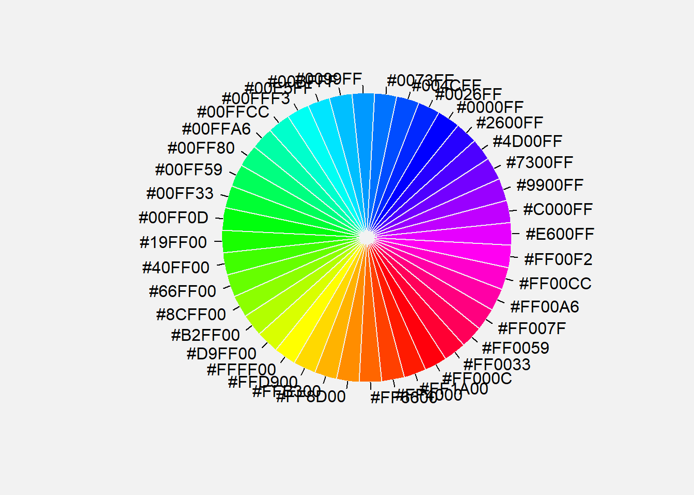
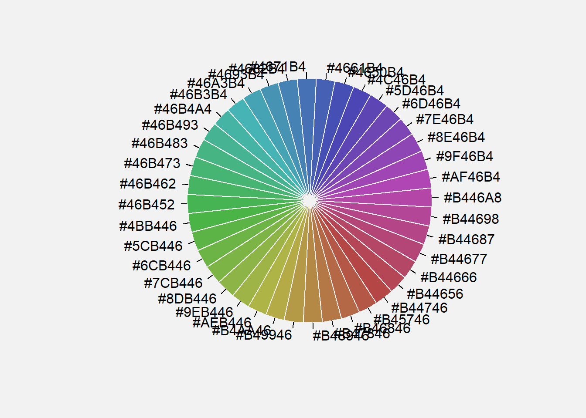
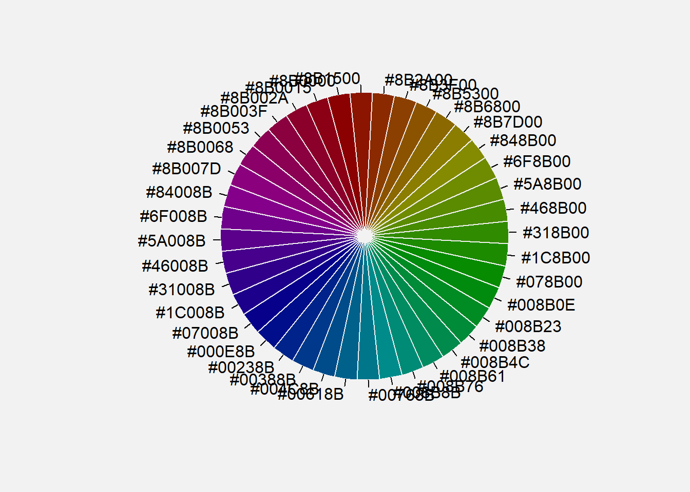

# Couleurs


```r
library(colortools)
library("RColorBrewer")
```

Dans cette section nous veront comment choisir les couleurs suivant les cas d'utilisation.

## TSL
Teinte, saturation, luminosité (ou valeur) sont les trois paramètres de description d'une couleur dans une approche psychologique de cette perception. 
Cette expression désigne des modèles de description des couleurs utilisés en graphisme informatique et en infographie, qui adaptent ces paramètres. 

## Rainbow pie chart

Une pallette composee par les couleurs du psectre de la lumière blanche qui sont des variations des 7 couleurs de l'arc en ciel, allant du rouge au violet et faisant un cycle complet.


```r
wheel("deepskyblue", num = 40, verbose = F)
```



Ici on a pris comme couleur de référence "deepbluesky".

On peut faire varier la teinte ou la saturation générale de notre rainbow pie chart en choisissant une autre couleur de référence.


```r
wheel("steelblue", num = 40, verbose = F)
```




```r
wheel("darkred", num = 40, verbose = F)
```




```r
display.brewer.all()
```


